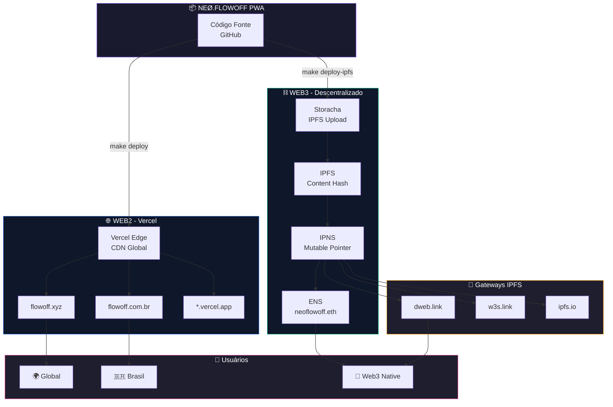

# NEØ FlowOFF PWA

PWA da NEØ·FlowOFF - Progressive Web Application para acesso ao ecossistema FlowOFF.

## 🚀 Sobre

Aplicação web progressiva que oferece acesso ao ecossistema NEØ FlowOFF com chat IA, integração Web3 e funcionalidades offline.

## 📊 Arquitetura de Deploy



## ⚡ Início Rápido

```bash
# Clone e instale
git clone git@github.com:neomello/neo-flowoff-pwa.git
cd neo-flowoff-pwa
npm install

# Configure variáveis de ambiente
cp env-example.txt .env

# Desenvolvimento
npm run dev

# Build para produção
npm run build
```

## 🌐 Deploy

### Web2 (Vercel)

```bash
make deploy
```

Deploy automático via Vercel para `flowoff.xyz` e `flowoff.com.br`.

### Web3 (IPFS/IPNS)

```bash
make deploy-ipfs
```

Deploy descentralizado via Storacha para IPFS/IPNS e ENS (`neoflowoff.eth.link`).

## 📚 Documentação

-  [Domínios e Deploy](./docs/DOMINIOS.md) - Arquitetura completa de deploy
-  [Guia Storacha/IPFS](./GUIA_STORACHA_IPFS.md) - Configuração Web3
-  [Contribuindo](./CONTRIBUTING.md) - Padrões de contribuição
-  [Segurança](./SECURITY.md) - Política de segurança

## 🛡️ Segurança

Implementa sanitização de entradas, rate limiting, CORS restrito e validação robusta. Consulte `SECURITY.md` para detalhes.

## 📄 Licença

MIT

---

<div align="center">
  <a href="mailto:neo@neoprotocol.space">
    
  </a>
  <a href="https://x.com/node_mello">
    
  </a>
  <a href="https://www.instagram.com/neoprotocol.eth/">
    
  </a>
  <a href="https://etherscan.io/">
    
  </a>
</div>

<div align="center">
  <i>"Expand until silence becomes structure."</i>
</div>
