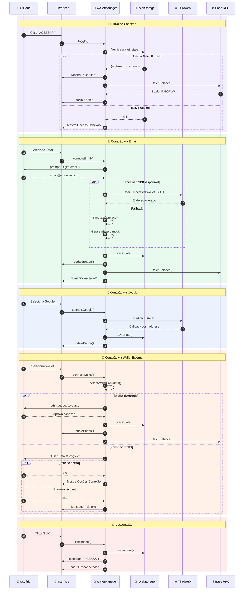
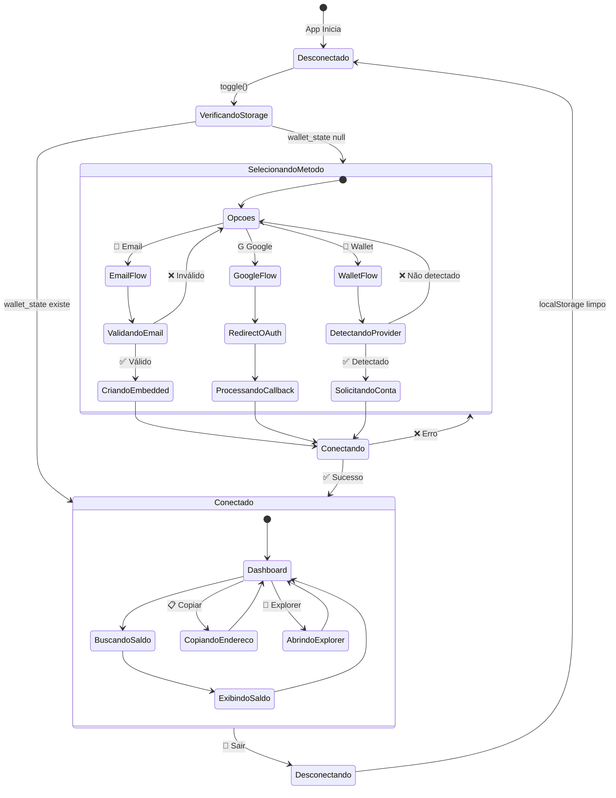
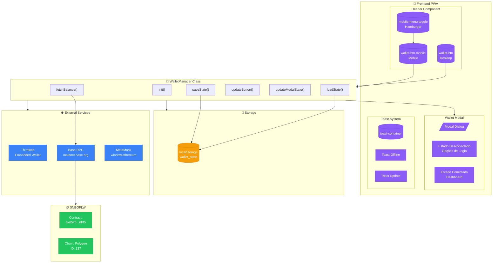

# 🔐 Fluxo de Autenticação - NEØ.FLOWOFF Wallet

> Documentação do fluxo de autenticação com $NEOFLW na Polygon Network

## Diagrama de Fluxo Completo

```mermaid
flowchart TD
    subgraph USER_ACTION["👆 Ação do Usuário"]
        A[("🔘 Clique em<br/>ACESSAR")]
    end

    subgraph INIT["⚡ Inicialização"]
        B{{"WalletManager.toggle()"}}
        C[/"Modal Wallet<br/>showModal()"/]
    end

    subgraph STATE_CHECK["🔍 Verificação de Estado"]
        D{{"localStorage<br/>wallet_state?"}}
        E[("📦 Parse JSON<br/>address + timestamp")]
    end

    subgraph CONNECTED["✅ Usuário Conectado"]
        F[/"Dashboard Wallet"/]
        G["🏠 Endereço Wallet<br/>0x1234...abcd"]
        H["💰 Saldo $NEOFLW<br/>via RPC Base"]
        I["📋 Copiar Endereço"]
        J["🔗 Ver no Explorer"]
        K["🚪 Desconectar"]
    end

    subgraph NEW_USER["🆕 Novo Usuário"]
        L[/"Opções de Conexão"/]
        M["📧 Email<br/>Embedded Wallet"]
        N["G Google OAuth<br/>Thirdweb Auth"]
        O["🦊 MetaMask<br/>External Wallet"]
    end

    subgraph EMAIL_FLOW["📧 Fluxo Email"]
        P[/"prompt() Email"/]
        Q{{"Validar @"}}
        R["❌ Email inválido"]
        S1{{"Thirdweb SDK<br/>disponível?"}}
        S2["✅ Criar Embedded<br/>via Thirdweb"]
        S3["⚡ Simulate Connect<br/>(fallback)"]
    end

    subgraph GOOGLE_FLOW["G Fluxo Google"]
        T{{"THIRDWEB_CLIENT_ID?"}}
        U["🔄 Redirect OAuth<br/>embedded-wallet.thirdweb.com"]
        V["⚡ Simulate Connect<br/>(fallback)"]
    end

    subgraph METAMASK_FLOW["🦊 Fluxo Wallet Externa"]
        W{{"Detecta Providers<br/>(MetaMask, Coinbase, etc)"}}
        X["eth_requestAccounts"]
        Y["❌ Nenhuma wallet"]
        Y2["💡 Oferece Email/Google"]
        Z["✅ Conectar conta"]
    end

    subgraph SUCCESS["🎉 Conexão Bem-sucedida"]
        AA["💾 saveState()<br/>localStorage"]
        AB["🔄 updateButton()<br/>Desktop + Mobile"]
        AC["📊 fetchBalance()<br/>RPC Polygon Network"]
        AD["❌ close() Modal"]
        AE[/"🍞 Toast<br/>Wallet conectada!"/]
    end

    subgraph BALANCE_FETCH["📊 Busca de Saldo"]
        AF1{{"Thirdweb SDK<br/>disponível?"}}
        AF2["🌐 Thirdweb API<br/>balanceOf()"]
        AF3["🌐 RPC: mainnet.base.org"]
        AF4["🌐 RPC Fallback<br/>(Alchemy, PublicNode, etc)"]
        AG["📝 eth_call<br/>balanceOf(address)"]
        AH["🔢 Parse Wei → Token"]
        AI["💰 Atualizar UI"]
    end

    subgraph DISCONNECT["🚪 Desconexão"]
        AJ["🗑️ localStorage.remove"]
        AK["🔄 Reset State"]
        AL["🔘 Botão: ACESSAR"]
        AM[/"🍞 Toast<br/>Desconectado"/]
    end

    %% Fluxo Principal
    A --> B
    B --> C
    C --> D
    
    %% Verificação de Estado
    D -->|"✅ Existe"| E
    D -->|"❌ Não existe"| L
    E --> F
    
    %% Dashboard Conectado
    F --> G
    F --> H
    G --> I
    G --> J
    G --> K
    H --> BALANCE_FETCH
    
    %% Novo Usuário - Opções
    L --> M
    L --> N
    L --> O
    
    %% Email Flow
    M --> P
    P --> Q
    Q -->|"❌ Inválido"| R
    R --> P
    Q -->|"✅ Válido"| S1
    S1 -->|"✅ SDK disponível"| S2
    S1 -->|"❌ SDK não disponível"| S3
    S2 --> SUCCESS
    S3 --> SUCCESS
    
    %% Google Flow
    N --> T
    T -->|"✅ Configurado"| U
    T -->|"❌ Não configurado"| V
    U --> SUCCESS
    V --> SUCCESS
    
    %% MetaMask Flow
    O --> W
    W -->|"❌ Nenhuma detectada"| Y
    Y --> Y2
    Y2 -->|"Usuário aceita"| L
    Y2 -->|"Usuário recusa"| [*]
    W -->|"✅ Detectado"| X
    X --> Z
    Z --> SUCCESS
    
    %% Success Actions
    SUCCESS --> AA
    AA --> AB
    AB --> AC
    AC --> AD
    AD --> AE
    
    %% Balance Fetch
    AF1 -->|"✅ SDK disponível"| AF2
    AF1 -->|"❌ SDK não disponível"| AF3
    AF2 --> AH
    AF3 --> AG
    AF3 -->|"❌ Falhou"| AF4
    AF4 --> AG
    AG --> AH
    AH --> AI
    
    %% Disconnect Flow
    K --> AJ
    AJ --> AK
    AK --> AL
    AL --> AM

    %% Styling
    classDef action fill:#8b5cf6,stroke:#7c3aed,color:#fff
    classDef check fill:#3b82f6,stroke:#2563eb,color:#fff
    classDef success fill:#22c55e,stroke:#16a34a,color:#fff
    classDef error fill:#ef4444,stroke:#dc2626,color:#fff
    classDef process fill:#06b6d4,stroke:#0891b2,color:#fff
    classDef storage fill:#f59e0b,stroke:#d97706,color:#fff
    
    class A,M,N,O action
    class D,Q,T,W,S1,AF1 check
    class S2,S3,Z,AA,AE,AM success
    class R,Y error
    class B,C,E,F,G,H,I,J,K,L,P,U,V,X,AB,AC,AD,AF2,AF3,AF4,AG,AH,AI,AJ,AK,AL,Y2 process
```

## Diagrama de Sequência



## Diagrama de Estados



## Arquitetura de Componentes



---

## 📝 Notas Técnicas

### Token $NEOFLW

- **Contrato**: `0x59aa4EaE743d608FBDd4205ebA59b38DCA755Dd2`
- **Rede**: Base (Chain ID: 8453)
- **Decimais**: 18
- **RPC**: `https://mainnet.base.org`

### localStorage Keys

- `wallet_state`: `{ address: string, timestamp: number }`

### Thirdweb Integration

- **Client ID**: Configurado via `window.THIRDWEB_CLIENT_ID`
- **Embedded Wallet**: Suporta Email e Google OAuth
- **External Wallet**: MetaMask via `window.ethereum`

---

*Documentação gerada em: 2025-12-18*
*Atualizada em: 2025-12-23*
*Versão: 2.4.11*

## 🔄 Fallbacks Implementados

### Email Connection

1. **Primário**: Thirdweb SDK (embedded wallet real)
2. **Fallback**: Simulate Connect (demo mode)

### Google Connection

1. **Primário**: Thirdweb SDK (OAuth via SDK)
2. **Fallback 1**: Redirect OAuth (embedded-wallet.thirdweb.com)
3. **Fallback 2**: Simulate Connect (demo mode)

### External Wallet Connection

1. **Detecção múltipla**: MetaMask, Coinbase Wallet, Brave, WalletConnect
2. **Fallback**: Oferece Email/Google se nenhuma wallet detectada

### Balance Fetch

1. **Primário**: Thirdweb SDK API
2. **Fallback 1**: RPC mainnet.base.org
3. **Fallback 2**: RPC Alchemy
4. **Fallback 3**: RPC PublicNode
5. **Fallback 4**: RPC 1RPC.io
